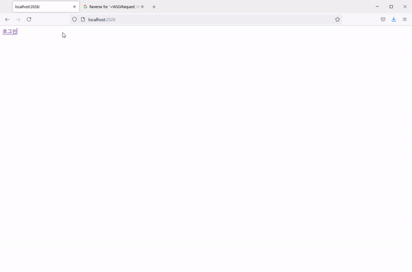
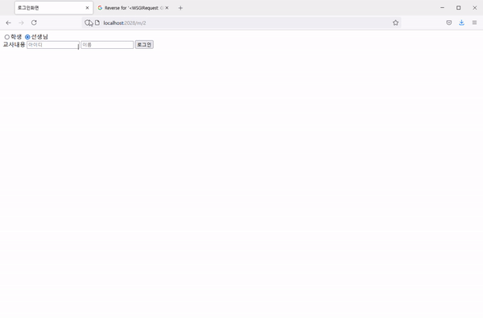

# Title
느티(고교학점제 수강시수 도우미)

# Overview
많은 학생들이 고교학점제를 하면서 수강신청을 하는데 시수를 계산하는데 있어서 불편함을 느끼는 모습을 봐왔다.
이런 점을 개선하기 위해 이 프로그램을 만들게 되었다,

# Demo
 ⬆[학생로그인]

 ⬆[교사로그인]

# Technologies used (libraries & versions)
python, django

# Unique elements

# Problems I faced

# What I learned
1. 비동기에 대해 배웠다.

# Codes
    pip install mysqlclient
    
    DATABASES = {
        'default': {
            'ENGINE': 'django.db.backends.mysql',
            'NAME': 'DB_name',
            'HOST': '127.0.0.1',
            'PORT': '3306',
            'USER': 'DB_user',
            'PASSWORD': 'DB_password',
        }
    }
    
    python manage.py makemigrations 
    python manage.py migrate
    
    pip install bcrypt
